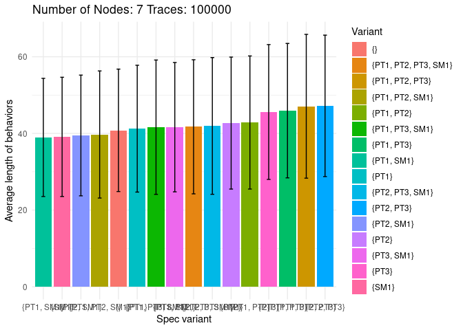
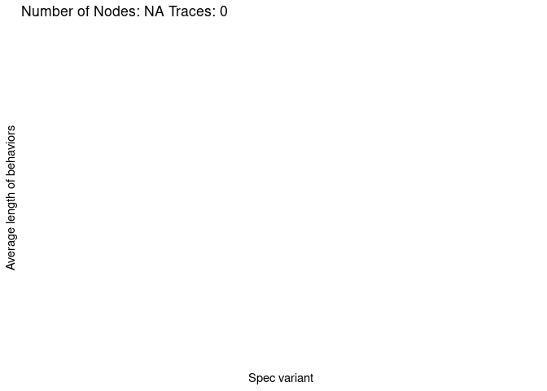
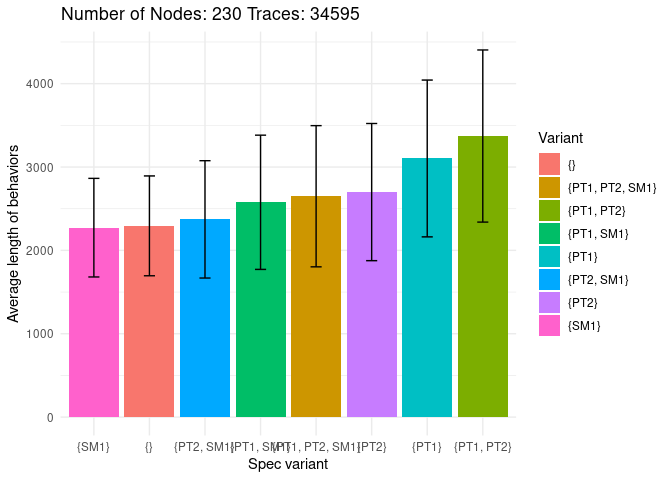
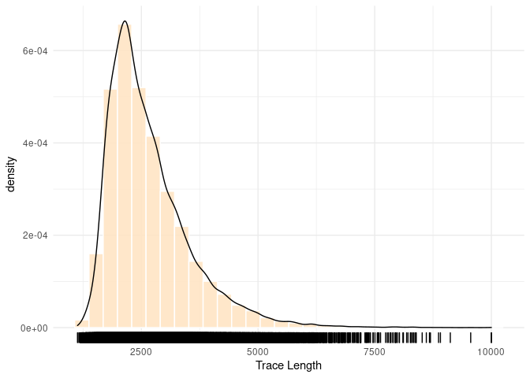
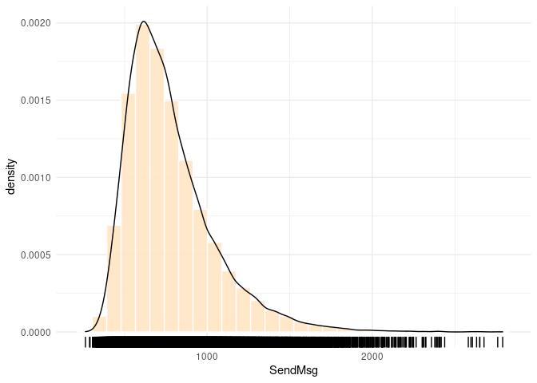
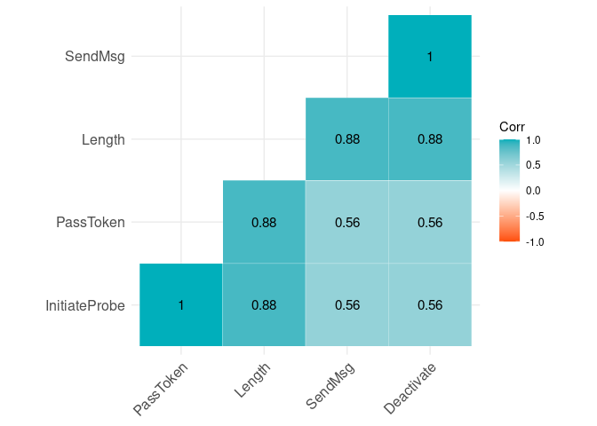

EWD840
================
Markus A Kuppe
2021-04-08

#### This file is generated on a host with all libraries via:

``` shell
Rscript -e "rmarkdown::render('README.Rmd')"
```

## What

As part of the preparations to discuss Dijkstra’s termination detection
algorithm
([EWD840](https://www.cs.utexas.edu/users/EWD/ewd08xx/EWD840.PDF)) in a
new [Dr. TLA+](https://github.com/tlaplus/DrTLAPlus) talk, we simulated
the [TLA+ model](./EWD840.tla) with TLC to obtain statistics. The basic
idea was to generate as many behaviors with TLC’s simulation mode as
possible and see how spec-level changes influence the average length of
behaviors until the algorithm detects termination. The spec-level
changes studied are:

1)  Color a node black regardless of where it sends an activation
    message (`SendMsg!SM1`)
2)  Pass along a black token independently of the node’s color
    (`PassToken!PT1`)
3)  Pass along the token even if the node is active (`PassToken!PT2`)

For the formal definition of a, b, c, please see the labels `SM1`,
`PT1`, and `PT2` in [EWD840.tla](./EWD840.tla).

### Correctness

Before we collected statistics, we verified the invariants `Inv` and
`IInv` for all feature combinations and constants `N \in 1..7` with both
TLC and [Apalache](https://github.com/informalsystems/apalache) (version
`0.11.1-SNAPSHOT build v0.11.0-24-g293c4b2`). Note that Apalache
required a [minor modification of Dijkstra’s inductive
invariant](https://github.com/informalsystems/apalache/issues/446) (see
[apalache.md](./apalache.md)):

``` tla
I ==
    {i \in 0..N-1: 0 <= i /\ i <= tpos}

\* Dijkstra's (inductive) invariant.
IInv ==
    \/ P0:: \A i \in Node : tpos < i => ~ active[i]
    \/ P1:: \E j \in I : color[j] = black
    \/ P2:: tcolor = black
```

Side note: This experiment surfaced a few issues in Apalache:

  - <https://github.com/informalsystems/apalache/issues/654>
  - <https://github.com/informalsystems/apalache/issues/653>
  - <https://github.com/informalsystems/apalache/issues/425>

### Data Collection

To minimize potential sources of error, we pushed data collection into
the TLA+ specification (also see module
[`EWD840_sim`](./EWD840_sim.tla)) and added two minor features to TLC.
The first feature was to add support to simulation mode to evaluate a
constant-level expression after a behavior is generated. With this, we
can write and flush per-behavior statistics that are stored in
`TLCGet/TLCSet` registers:

``` tla
---- MODULE EWD840_sim ----
...
PostBehavior == 
    /\ LET l == TLCGet("level")
           ip == TLCGet(1)
           sm == TLCGet(2)
           pt == TLCGet(3)
           da == TLCGet(4)
           ft == feature
           IO == INSTANCE IOUtils
        IN IO!IOCSV("%1$s#%2$s#%3$s#%4$s#%5$s#%6$s#%7$s", <<ft, l, ip, sm, pt, da, N>>, "out.csv")
    /\ \A i \in 1..4: TLCSet(i, 0)

=====
```

Secondly, we added a `CSV` operator (with a Java module override) to the
[TLA+ CommunityModules](https://github.com/tlaplus/CommunityModules) to
efficiently write the `TLCGet/TLCSet` registers to a file on disk:

``` tla
CSV!CSVWrite(template, data, file)
```

Note that both TLC features have not yet been made available publicly.

## Results

Without further ado, below are plots of the average behavior length for
varying numbers of nodes (`N=7`, `N=42`, `N=230`), depending on which
one of the three “optimizations” `SM1`, `PT1`, and `PT2` are enabled:

### N=7

``` r
## R script
library(dplyr)
by_variant <- group_by(data,Variant)
summary = summarise(by_variant,
                    mean_length = mean(Length),
                    var_length = var(Length),
                    sd_length = sd(Length),
                    mean(InitiateProbe),
                    mean(SendMsg),
                    mean(PassToken),
                    mean(Deactivate),
                    N = mean(Node),
                    T = mean(Length-T)
)
```

``` r
library(knitr)
kable(format = "markdown", summary[, c(1,2,5,6,7,8,10)], digits=2, caption = "Data N=7 grouped by 'Variant'")
```

| Variant              | mean\_length | mean(InitiateProbe) | mean(SendMsg) | mean(PassToken) | mean(Deactivate) |     T |
| :------------------- | -----------: | ------------------: | ------------: | --------------: | ---------------: | ----: |
| {}                   |        40.59 |                2.21 |         11.96 |           13.24 |            12.18 | 12.91 |
| {PT1, PT2, PT3, SM1} |        41.64 |                2.57 |         12.03 |           13.83 |            12.21 | 13.49 |
| {PT1, PT2, PT3}      |        47.07 |                4.03 |         12.20 |           17.56 |            12.28 | 17.56 |
| {PT1, PT2, SM1}      |        39.42 |                2.04 |         12.00 |           12.19 |            12.19 | 11.28 |
| {PT1, PT2}           |        42.75 |                2.49 |         12.12 |           14.91 |            12.23 | 13.36 |
| {PT1, PT3, SM1}      |        41.38 |                2.53 |         11.99 |           13.67 |            12.19 | 13.55 |
| {PT1, PT3}           |        45.98 |                3.73 |         12.12 |           16.88 |            12.26 | 17.61 |
| {PT1, SM1}           |        39.11 |                2.00 |         11.97 |           11.97 |            12.17 | 11.26 |
| {PT1}                |        41.28 |                2.29 |         12.04 |           13.74 |            12.21 | 12.89 |
| {PT2, PT3, SM1}      |        41.64 |                2.57 |         12.04 |           13.82 |            12.22 | 13.52 |
| {PT2, PT3}           |        46.96 |                4.01 |         12.20 |           17.47 |            12.28 | 17.59 |
| {PT2, SM1}           |        39.41 |                2.02 |         12.05 |           12.12 |            12.22 | 11.26 |
| {PT2}                |        42.59 |                2.47 |         12.10 |           14.80 |            12.22 | 13.39 |
| {PT3, SM1}           |        41.40 |                2.53 |         12.01 |           13.66 |            12.20 | 13.59 |
| {PT3}                |        45.67 |                3.68 |         12.07 |           16.70 |            12.22 | 17.67 |
| {SM1}                |        38.99 |                1.97 |         11.99 |           11.83 |            12.19 | 11.26 |

Data N=7 grouped by ‘Variant’

The summary confirms that the number of `Deactivate`, `PassToken`,
`SendMsg` and `InitiateProbe` actions is the same regardless of the
enabled optimizations.

``` r
## R script
library(ggplot2)
ggplot(summary, 
  aes(x = reorder(Variant, mean_length), y = mean_length, fill = Variant)) +
  geom_bar(stat = "identity") +
  geom_errorbar(aes(ymin=mean_length-sd_length, ymax=mean_length+sd_length), width=.2,
                position=position_dodge(.9)) +
  theme_minimal() +
  labs(
    x = "Spec variant",
    y = "Average length of behaviors",
    title = paste(
      "Number of Nodes:", data[,7][1], "Traces:", nrow(data)
  )
)
```

<!-- -->

### N=42

<!-- -->

### N=230

<!-- -->

Statistically, the “optimization” `SM1` correlates with the shortest
average behavior length, which follows the intuition that tainting the
node if it activates lower-numbered nodes, results in additional rounds
before termination is detect. Surprisingly though, `PT1` and `PT2` have
negative effects on the average behavior lenght–it takes longer to
detect termination.

-----

## Random/Eye-ball statistics

### Data distributions (behavior length and SendMsg actions) for N=7

``` r
library(ggplot2)
ggplot(data = data, mapping = aes(x=Length)) + 
  geom_histogram(aes(y=..density..),fill="bisque",color="white",alpha=0.9) + 
  geom_density() +
  geom_rug() +
  labs(x='Trace Length') +
  theme_minimal()
```

<!-- -->

``` r
ggplot(data = data, mapping = aes(x=SendMsg)) + 
  geom_histogram(aes(y=..density..),fill="bisque",color="white",alpha=0.9) + 
  geom_density() +
  geom_rug() +
  labs(x='SendMsg') +
  theme_minimal()
```

<!-- -->

### Correlation matrix for N=7

``` r
##install.packages("ggcorrplot")
library("ggcorrplot")
my_data <- data[, c("Length", "SendMsg", "InitiateProbe", "PassToken", "Deactivate")]
p.mat <- cor_pmat(my_data)

## Check for correlation in 'data'
## 'spearman' (3) correlation because data has no normal distribution
## (see previous plots).
corr <- round(cor(my_data), 3)

ggcorrplot(corr, p.mat = cor_pmat(my_data),
           hc.order = TRUE, type = "lower",
           color = c("#FC4E07", "white", "#00AFBB"),
           outline.col = "white", lab = TRUE)
```

<!-- -->

The correlation of TLA+ actions pretty much follows causality.
